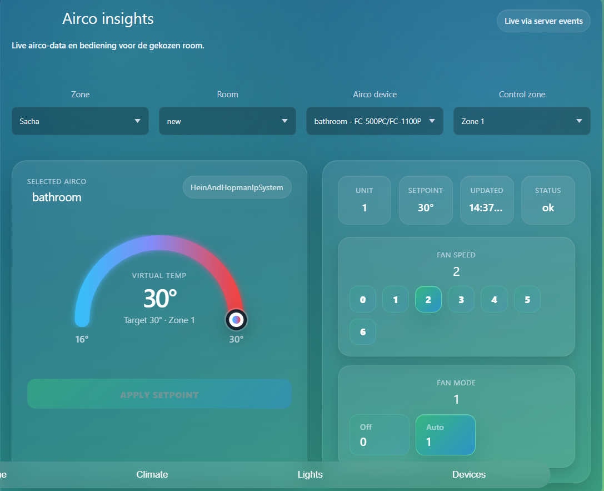
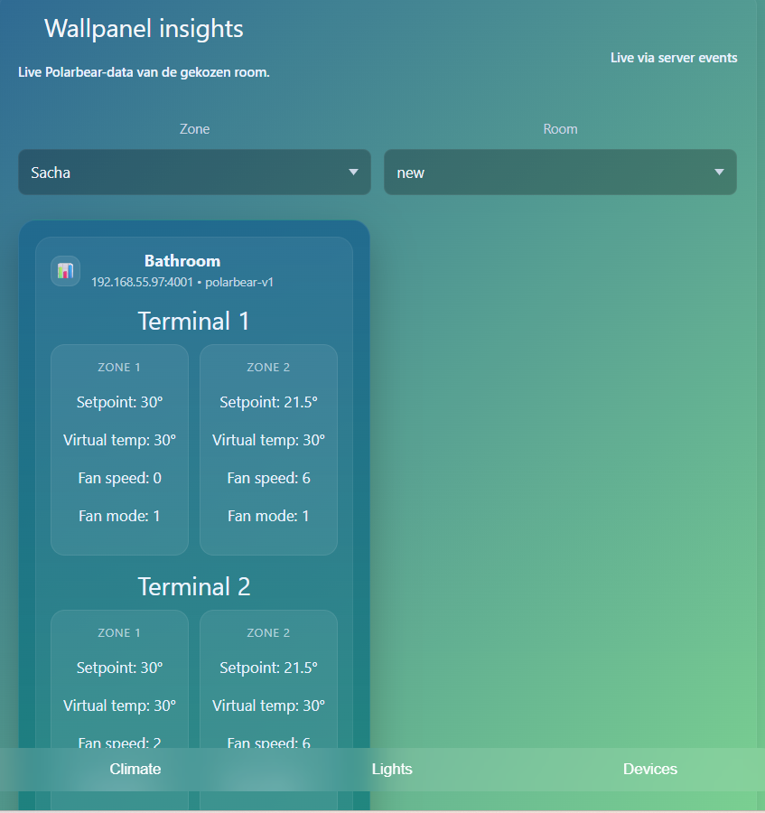

# Verantwoording datavisualisatie

## 1. Inleiding

Mijn applicatie is een CRUD-applicatie waarin airco-systemen, zones, ruimtes en wallpanels beheerd en bekeken kunnen worden. Binnen deze applicatie is ook een dashboard aanwezig waarin actuele aircogegevens visueel worden weergegeven.

De visualisatie is dus geïntegreerd in de CRUD-applicatie. De CRUD-functionaliteit wordt gebruikt om gegevens te beheren, terwijl het dashboard deze gegevens omzet naar een overzichtelijk en begrijpelijk beeld voor de eindgebruiker.

## 2. Gebruikte dataset

De gebruikte dataset bestaat uit gegevens van airco-systemen, wallpanels, zones en ruimtes. Deze data wordt gebruikt om de actuele status van een klimaatsysteem weer te geven.

Voorbeelden van gegevens die in de dataset voorkomen zijn:

| Gegeven | Betekenis |
|---|---|
| Zone | De geselecteerde zone, bijvoorbeeld een gebouwdeel of gebruikersgroep |
| Room | De ruimte waarin het airco-systeem of wallpanel zich bevindt |
| Airco device | Het geselecteerde airco-apparaat |
| Control zone | De specifieke zone die bediend of bekeken wordt |
| Setpoint | De ingestelde doeltemperatuur |
| Virtual temp | De actuele of berekende temperatuur |
| Fan speed | De ventilatorsnelheid |
| Fan mode | De ingestelde ventilatiemodus |
| Status | De huidige status van het systeem, bijvoorbeeld `ok` |
| Updated | Het moment waarop de data voor het laatst is bijgewerkt |

Deze dataset zorgt ervoor dat gebruikers inzicht krijgen in de actuele klimaatsituatie per ruimte, zone of airco-apparaat.

## 3. Gemaakte visualisaties

Binnen de applicatie zijn meerdere vormen van visualisatie toegepast.

### 3.1 Dashboard met actuele klimaatgegevens

In het dashboard worden actuele gegevens zoals temperatuur, setpoint, fan speed, fan mode en status weergegeven. De gebruiker kan hierdoor snel zien wat de huidige situatie is van het geselecteerde airco-systeem.

### 3.2 Temperatuurmeter

De temperatuur wordt niet alleen als tekst weergegeven, maar ook visueel met een temperatuurmeter. Hierdoor kan de gebruiker sneller begrijpen waar de huidige temperatuur zich bevindt binnen een bepaald bereik.

### 3.3 Cards en statusblokken

Belangrijke waarden worden weergegeven in aparte kaarten, zoals:

- unit
- setpoint
- laatst bijgewerkt
- status
- fan speed
- fan mode

Door deze gegevens in aparte blokken te tonen, is de informatie overzichtelijk en snel te scannen.

### 3.4 Filters

De gebruiker kan filteren op onder andere:

- Zone
- Room
- Airco device
- Control zone

Hierdoor kan de gebruiker gericht de juiste data bekijken zonder dat alle informatie tegelijk zichtbaar hoeft te zijn.

## 4. Afstemming op verschillende typen eindgebruikers

De visualisatie is afgestemd op verschillende soorten gebruikers.

| Eindgebruiker | Behoefte | Hoe de visualisatie daarop aansluit |
|---|---|---|
| Gewone gebruiker | Snel zien wat de temperatuur en airco-status is | Grote temperatuurweergave, duidelijke status en overzichtelijke kaarten |
| Beheerder | Zones, ruimtes en apparaten kunnen controleren | Filters voor zone, room, airco device en control zone |
| Technische gebruiker | Details zoals fan speed, fan mode en setpoint bekijken | Technische waarden worden zichtbaar getoond in aparte cards |
| Beoordelaar of docent | Kunnen zien dat data correct wordt opgehaald en weergegeven | De applicatie toont data op meerdere plekken in het dashboard |

Door deze opzet is de visualisatie niet alleen geschikt voor technische gebruikers, maar ook voor eindgebruikers die snel willen begrijpen wat er aan de hand is.

## 5. Werkende software

De visualisatie wordt weergegeven in werkende software. De gebruiker kan binnen de applicatie navigeren naar het klimaat- of airco-overzicht en daar de actuele data bekijken.

De applicatie bevat onder andere:

- een zijmenu met zones
- een dashboard voor wallpanel insights
- een dashboard voor airco insights
- dropdowns om data te filteren
- kaarten met actuele meetwaarden
- een temperatuurmeter
- statusinformatie van het airco-systeem

Hiermee wordt aangetoond dat de visualisatie niet alleen als ontwerp bestaat, maar ook daadwerkelijk in de software is geïmplementeerd.

## 6. Bewijsstukken

Screenshot van het airco-dashboard

Screenshot van het wallpanel dashboard

## 7. Conclusie

De visualisatie binnen mijn project bestaat uit een  dashboard voor airco- en wallpaneldata. De applicatie toont niet alleen ruwe data, maar zet deze om naar een overzichtelijke interface met temperatuurweergaves, statuskaarten, filters en bedieningsinformatie.

Daarmee voldoet de applicatie aan de eis dat er een dataset wordt gevisualiseerd en dat de visualisatie correct wordt weergegeven in werkende software.